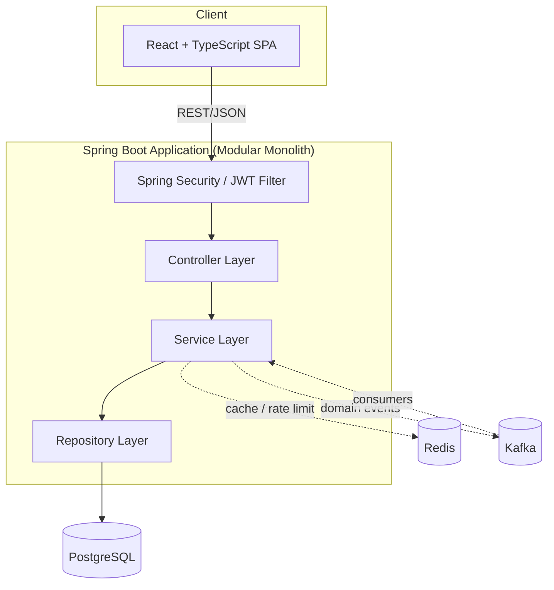
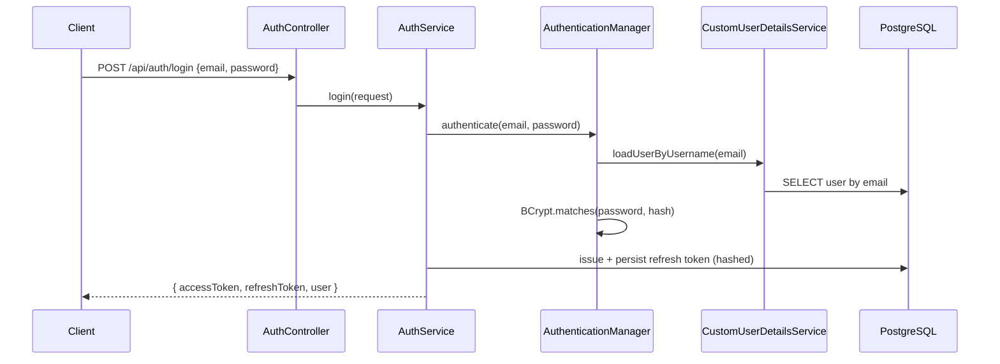
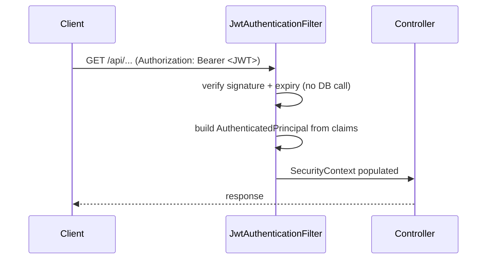
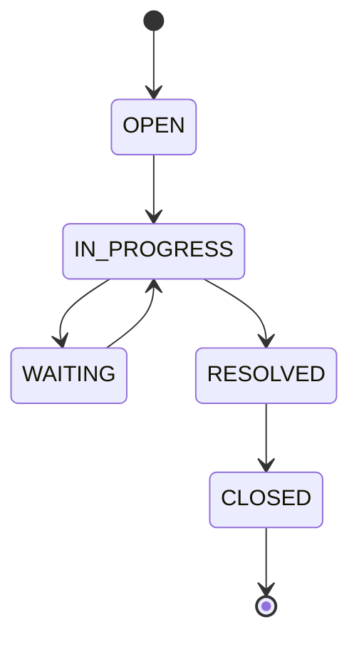
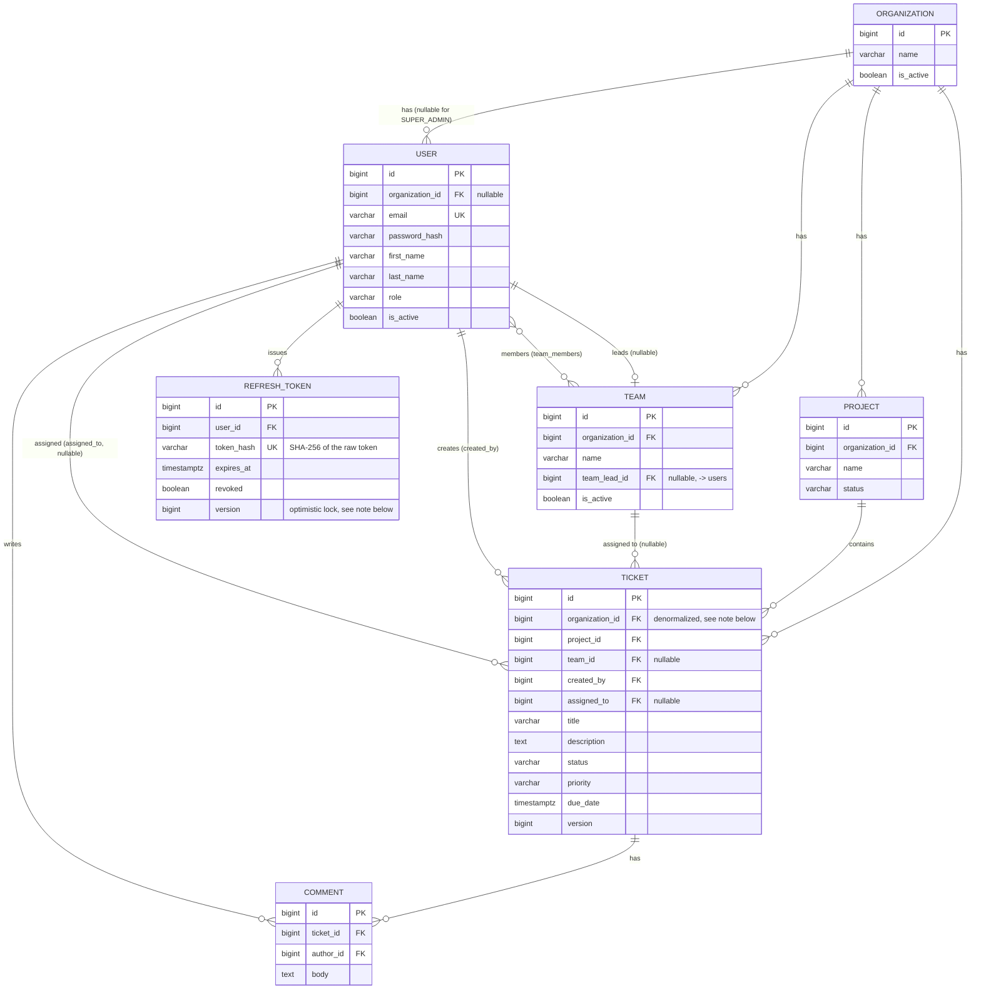

# FlowDesk

FlowDesk is a multi-tenant support and workflow management platform — a
lightweight combination of Jira and Zendesk. It is a portfolio project built
to demonstrate practical, production-style Spring Boot backend engineering:
multi-tenancy, RBAC, JWT auth with refresh token rotation, ticket workflow
state machines, JPA/Hibernate performance concerns, Redis caching and rate
limiting, Kafka-driven domain events, and a tested, containerized,
CI-backed delivery pipeline.

The backend is the primary focus of this project. The frontend (React +
TypeScript) is intentionally kept simpler.

> **Status:** Phase 8 (Kafka) complete. See [Development phases](#development-phases) below.

## Project overview

An organization (tenant) has users, teams, and projects. Projects contain
tickets. Tickets move through a controlled workflow, get assigned to
agents/teams, accumulate comments and an audit trail, and trigger
notifications on important events. Users authenticate via JWT and are
authorized by role, scoped to their own organization's data.

## Tech stack

**Backend**
- Java 21, Spring Boot 3.5.3
- Spring Web, Spring Data JPA (Hibernate), Spring Security, Spring Validation
- Spring Cache, Spring AOP, Spring Actuator, Spring Kafka
- PostgreSQL 16, Flyway
- Redis
- JJWT (self-signed JWT issuance/validation)
- Lombok
- Maven (via Maven Wrapper)

**Frontend** *(added in Phase 12)*
- React, TypeScript, React Router, Axios

**Infrastructure**
- Docker / Docker Compose
- GitHub Actions

> **Note on Spring Boot version:** the Spring Boot 3.x line is used
> deliberately (pinned to the last 3.x GA, 3.5.3) rather than the current
> 4.x line, matching the intended scope of this project. Spring Initializr
> no longer offers 3.x as a generation option, so the Maven project here
> was scaffolded by hand against `spring-boot-starter-parent:3.5.3`.

## Architecture

FlowDesk is a **modular monolith**, not a microservices system.



### Why a modular monolith?

The domain (organizations, users, teams, projects, tickets) is cohesive and
highly relational — most operations touch multiple entities in a single
transaction (e.g. assigning a ticket updates the ticket, writes an activity
record, and may update team workload). Splitting this into independently
deployed services would introduce distributed transaction complexity and
network overhead without a corresponding scaling or team-ownership benefit
at this project's scale. Instead, the codebase is organized into clearly
bounded modules (`auth`, `user`, `organization`, `team`, `project`,
`ticket`, `comment`, `notification`, `dashboard`, `audit`) with disciplined
internal layering, so any module could be extracted into its own service
later if a genuine scaling reason emerged.

## Modules

| Module | Responsibility |
|---|---|
| `auth` | Registration, login, JWT issuance, refresh token rotation, logout |
| `user` | User CRUD, role management, profile |
| `organization` | Tenant (organization) management |
| `team` | Teams within an organization, membership, team leads |
| `project` | Projects within an organization |
| `ticket` | Core ticket CRUD, workflow, assignment, filtering/search |
| `comment` | Ticket comments |
| `notification` | In-app notifications driven by domain events |
| `dashboard` | Aggregated reporting endpoints |
| `audit` | Ticket activity history |
| `common` | Shared exceptions, base types, utilities used across modules |
| `config` | Cross-cutting Spring configuration (security, cache, Kafka, etc.) |
| `security` | JWT issuance/validation, the per-request auth filter, Spring Security config |

Each module separates `entity` / `repository` / `service` / `controller` /
`dto` / `mapper` / `exception` into their own sub-packages — but only the
layers that module actually needs; a layer isn't created just for
symmetry with the others. As of Phase 3:

```
com.flowdesk.auth
├── entity/        RefreshToken
├── repository/    RefreshTokenRepository
├── service/       AuthService
├── controller/    AuthController
├── dto/           RegisterRequest, LoginRequest, RefreshRequest, AuthResponse
└── exception/     InvalidRefreshTokenException

com.flowdesk.ticket
├── entity/        Ticket, TicketStatus, TicketPriority
├── repository/    TicketRepository
├── service/       TicketService, TicketWorkflow
├── controller/    TicketController
├── dto/           CreateTicketRequest, UpdateTicketRequest, TicketResponse
├── mapper/        TicketMapper
└── exception/     InvalidTicketTransitionException

com.flowdesk.team
├── entity/        Team
├── repository/    TeamRepository
├── service/       TeamService
├── controller/    TeamController
├── dto/           CreateTeamRequest, AssignTeamLeadRequest, TeamResponse
└── mapper/        TeamMapper
```

## Multi-tenancy

FlowDesk uses a **shared database, shared schema** multi-tenant model.
Tenant-owned tables carry an `organization_id` column, and tenant isolation
is enforced in the service layer — never assumed from the frontend. A user
from Organization A must never be able to read or modify Organization B's
data via any API, regardless of what IDs are guessed or passed in.

**Brought forward from Phase 5 into Phase 4.** The spec's own phase plan
puts tenant-isolation *testing* in Phase 5, separately from ticket CRUD in
Phase 4 - but that would mean shipping ticket/project endpoints with a
known cross-org data leak for a whole phase and calling it "coming later."
Every service added in Phase 4 (`ProjectService`, `TicketService`,
`CommentService`, `UserService`) checks the resource's `organization_id`
against the caller's before returning or mutating anything, from the
start. Phase 5 is where this gets hardened and tested *systematically*
across every module at once, rather than closing a hole that was left
open on purpose.

**The pattern, used identically in every service:**

```java
private Project loadTenantScoped(Long id, AuthenticatedPrincipal caller) {
    Project project = projectRepository.findById(id)
            .orElseThrow(() -> ResourceNotFoundException.of("Project", id));
    if (!project.getOrganization().getId().equals(caller.organizationId())) {
        throw new TenantAccessDeniedException(/* ... */);
    }
    return project;
}
```

`TenantAccessDeniedException` is a distinct type internally (so logs and
code clearly show *why* access was denied), but is mapped to the exact
same 404 response as a genuinely missing resource - see
[Architecture decisions](#architecture-decisions-adr-style) for why a 403
here would actually leak information.

**Role-based visibility is layered on top of, and enforced the same way
as, tenant isolation.** Section 6 of the spec doesn't just say "stay
within your organization" - a plain `USER` should see only tickets they
created, an `AGENT` only ones assigned to them, a `TEAM_LEAD` only their
team's. `TicketService.isVisibleToCaller` enforces this per-role rule
right alongside the tenant check, and the *same* exception/response
(404) covers both "wrong organization" and "right organization, but not
within your role's visibility scope" - both should look identical to a
caller who shouldn't see the resource either way.

### Phase 5: hardening and a real gap found

Per the plan above, Phase 5 completed two things Phase 4 explicitly
deferred:

- **`TenantIsolationIntegrationTest`**: the spec's Section 5 guarantee
  ("Organization A cannot access Organization B's data... enforced
  server-side"), made into one explicit, auditable test class covering
  every organization-scoped resource (Project, Ticket, Comment, Team,
  User) in the same place, rather than left as incidental coverage
  scattered across each module's own tests.
- **Full Team management** (`team.service.TeamService`) - previously
  only the entity/repository existed (Phase 2), with no API at all. This
  was also the only way to make `TEAM_LEAD`'s ticket-visibility rule
  testable through the *real* API rather than only via directly
  constructed entities in `TicketServiceTest`'s unit tests -
  `TeamManagementIntegrationTest.teamLead_seesTheirTeamsTickets_throughTheRealApi`
  proves it end-to-end.

**A real, previously-shipped security gap was also found and fixed:**
`AuthService.refresh()` never actually checked `User.active`, despite the
Phase 3 README claiming it did. A deactivated user could keep refreshing
their session for up to `app.jwt.refresh-token-ttl` (7 days by default)
after being deactivated - the access-token staleness trade-off
documented under [Authentication flow](#authentication-flow) was
supposed to be bounded by refresh re-checking active status, and it
wasn't. Two things closed this properly, not just the missing check:

1. `AuthService.refresh` now rejects a token belonging to an inactive
   user.
2. `UserService.setActive(id, false, ...)` and `changeRole` now
   proactively call `AuthService.revokeAllTokensForUser`, which runs a
   single bulk `UPDATE ... WHERE user_id = ? AND revoked = false` -
   ending *every* outstanding session immediately (a user could
   plausibly be logged in on several devices) rather than waiting for
   each token to individually hit the check in (1) on its next use.

Finding (1) alone would have been enough to close the hole, but relying
solely on "the next refresh attempt will fail" leaves already-issued
refresh tokens sitting valid in the database until someone tries to use
them - (2) revokes them immediately instead. This bulk-update path itself
surfaced a second, subtler bug during testing - see the `@Modifying`
persistence-context note in [JPA / Hibernate](#jpa--hibernate).

## Authentication flow

FlowDesk uses two independent authentication mechanisms, matching the
spec's two flow diagrams (Section 8) - one for logging in, one for every
request afterward:





**Login** goes through Spring Security's real machinery -
`AuthenticationManager` → `DaoAuthenticationProvider` →
`CustomUserDetailsService` → `PasswordEncoder` (BCrypt) - a one-time
database hit per login, which is fine since logins are infrequent.

**Every other authenticated request** is authenticated entirely by
`JwtAuthenticationFilter`, which verifies the JWT's signature and expiry
and builds the security principal directly from its claims -
`UserDetailsService` and the database are never touched. This is the
spec's explicit guidance: don't invalidate/re-validate access tokens via
an expensive per-request database lookup.

**JWT claims:** `sub` (user id), `email`, `role`, `organizationId`
(omitted for `SUPER_ADMIN`), `iat`, `exp`. The spec describes this as
`roles` (plural); FlowDesk models one role per user, so the claim is
singular - documented here rather than left as an unexplained deviation.

**Trade-off this implies:** if a user is deactivated or has their role
changed, their current *access token* remains valid - and thus so do
their old permissions - until it naturally expires
(`app.jwt.access-token-ttl`, 15 minutes by default); there's no
per-request database check that could catch this sooner without
reintroducing the "expensive lookup on every request" problem JWTs are
meant to avoid. Refreshing *does* hit the database and re-checks
`User.active`, so this staleness window is bounded to at most one
access-token lifetime and never survives a refresh - and, as of Phase 5,
deactivating a user or changing their role also proactively revokes every
refresh token they currently hold (see
[Multi-tenancy](#multi-tenancy)'s Phase 5 section), so they can't even
ride that window out by refreshing first.

**Refresh tokens** are opaque random strings (256 bits of entropy via
`SecureRandom`), not JWTs - there's no benefit to making them
self-describing when they're checked against the database on every use
anyway (for rotation and revocation). Only a SHA-256 hash of the token is
stored (see [Database schema](#database-schema) for why SHA-256 and not
BCrypt here). Every successful `/api/auth/refresh` call **rotates** the
token: the presented one is revoked and a brand new one issued, so a
stolen refresh token stops working the moment the legitimate client next
refreshes.

**Logout** revokes the presented refresh token server-side. There's
deliberately no way to invalidate an already-issued access token directly
(see the trade-off above) - only refresh tokens are revocable, which is
exactly what the spec asks for.

**Registration** (`POST /api/auth/register`) is self-service tenant
sign-up: it provisions a *brand-new organization* with the caller as its
first user, in the `ORG_ADMIN` role, and logs them in immediately
(returns tokens directly, no separate login call needed). There is no way
to self-register into an *existing* organization - once RBAC exists
(Phase 5), an `ORG_ADMIN` adds further users to their organization
directly.

**Endpoints:**

| Method | Path | Auth required | Notes |
|---|---|---|---|
| POST | `/api/auth/register` | No | Creates org + first `ORG_ADMIN`, returns tokens |
| POST | `/api/auth/login` | No | Returns tokens |
| POST | `/api/auth/refresh` | No (refresh token in body) | Rotates the refresh token |
| POST | `/api/auth/logout` | No (refresh token in body) | Idempotent; always 204 |
| GET | `/api/auth/me` | Yes (access token) | Returns the caller's profile |

`/logout` and `/refresh` are intentionally not gated behind a valid
*access* token - the refresh token in the request body is itself the
credential being presented/revoked, and requiring a still-valid access
token just to log out would be user-hostile once it's already expired.

**Rate limiting** on login attempts (spec Section 25), and on
register/refresh alongside it, is implemented in Phase 7 - see
[Redis](#redis).

**CSRF is disabled** for the API. CSRF matters for cookie-based session
authentication, where a browser automatically attaches credentials to
every request to a site, including ones triggered by a malicious page.
FlowDesk's API is stateless and bearer-token-based (`Authorization: Bearer
<token>`) - a browser never attaches that header on its own, so there's
no cross-site request forgery vector to defend against here. **CORS** is
configured with an explicit allow-list (`app.cors.allowed-origins`,
defaulting to the local Vite/CRA dev server ports), not a wildcard.

## Ticket workflow



Enforced in `ticket.service.TicketWorkflow`, a plain stateless lookup
table - `OPEN -> CLOSED` directly, or any other transition not drawn
above, is rejected with `InvalidTicketTransitionException` (409). There's
deliberately no `RESOLVED -> IN_PROGRESS` "reopen" path, even though a
real product would likely want one eventually - only the transitions the
spec explicitly draws are implemented; adding a reopen path is a one-line
change to the transition map when a real requirement calls for it, not a
"for completeness" addition now. `TicketWorkflowTest` checks every
`(from, to)` pair against this exact graph, not just a couple of
happy-path examples.

### Role permissions (Section 6 of the spec)

| Action | ORG_ADMIN | TEAM_LEAD | AGENT | USER |
|---|---|---|---|---|
| Create ticket | ✅ | ✅ | ✅ | ✅ |
| View ticket | any in org | their team's | assigned to them | created by them |
| Update fields / change status | ✅ | ✅ (their team's) | ✅ (assigned to them) | ❌ |
| Reassign (`teamId`/`assignedToId`) | ✅ | ✅ | ❌ | ❌ |
| Delete ticket | ✅ | ❌ | ❌ | ❌ |
| Comment | ✅ | ✅ | ✅ | ✅ (their own tickets) |
| Edit own comment | ✅ | ✅ | ✅ | ✅ |
| Delete own comment | ✅ | ✅ | ✅ | ✅ |
| Delete *any* comment (moderation) | ✅ | ❌ | ❌ | ❌ |

The last row is an addition beyond the spec's literal "delete own
comment" - some minimal moderation capability for an admin role is a
reasonable, small extension, not scope creep.

`GET /api/tickets` combines the default per-role visibility scope with
*user-supplied* filters (status/priority/project/team/assignee/title
search) via `JpaSpecificationExecutor` - see [Advanced JPA](#advanced-jpa-phase-6)
below for how Phase 6 replaced the one-fixed-query-per-role approach this
section used to describe.

### Prerequisites this phase added

The spec's Section 15 lists ticket CRUD endpoints, but a ticket has a
**required** `project` foreign key, and no phase in the spec's plan ever
builds a Project API - so ticket creation was untestable without one.
Two small, necessary additions came out of that gap:

- **Minimal Project CRUD** (`POST/GET/PUT /api/projects`,
  `PATCH /api/projects/{id}/archive`) - `ORG_ADMIN` for
  create/update/archive, any org member for read.
- **Minimal User endpoints** - read-only listing
  (`GET /api/users`, `GET /api/users/{id}`) so a ticket's assignee can be
  chosen at all, plus `POST /api/users` (`ORG_ADMIN`-only). The latter was
  *not* part of the original Phase 4 scope - it was added after manual
  verification showed that registration only ever creates the first
  `ORG_ADMIN`, meaning an organization could never have a second user to
  assign anything to. Phase 5 completed this with
  `PATCH /api/users/{id}/active` and `PATCH /api/users/{id}/role`
  (both `ORG_ADMIN`-only, and both reject targeting your own account -
  an `ORG_ADMIN` can't deactivate or demote themselves and risk locking
  the organization out entirely).

## Team management

Built in Phase 5 - previously only the entity/repository existed
(Phase 2), with no API at all, which also meant `TEAM_LEAD`'s
ticket-visibility rule (above) was untestable except via directly
constructed entities.

| Action | Endpoint | Authorization |
|---|---|---|
| Create team | `POST /api/teams` | `ORG_ADMIN` |
| Get / list teams | `GET /api/teams`, `GET /api/teams/{id}` | any org member |
| Update name/description | `PUT /api/teams/{id}` | `ORG_ADMIN` |
| Deactivate | `PATCH /api/teams/{id}/deactivate` | `ORG_ADMIN` |
| Assign team lead | `PATCH /api/teams/{id}/lead` | `ORG_ADMIN` |
| List members | `GET /api/teams/{id}/members` | any org member |
| Add / remove member | `POST`/`DELETE /api/teams/{id}/members/{userId}` | `ORG_ADMIN` **or** that team's own `TEAM_LEAD` |

The last row needs a row-level check, not just a role check -
`@PreAuthorize` can express "must be `ORG_ADMIN` or `TEAM_LEAD`" but not
"must be *this team's* lead", so `TeamService.requireCanManageMembers`
checks `team.getTeamLead().getId().equals(caller.userId())` once the team
is loaded - the same pattern `TicketService` uses for reassignment
authorization.

## Database schema



Migrations: `backend/src/main/resources/db/migration/V1__create_organizations.sql`
through `V8__create_comments.sql`.

### Schema design decisions

- **`organization_id` is nullable on `users`.** `SUPER_ADMIN` accounts are
  platform-level — they manage organizations themselves rather than
  belonging to one — so they're the only role without an organization.
  Every other role always has one.
- **Email is unique platform-wide**, not per-organization, so login can
  look a user up by email alone without first asking which organization
  they belong to.
- **`tickets.organization_id` is denormalized** — a ticket is already
  transitively scoped to an organization via `project.organization`, but
  storing it directly avoids joining through `projects` on every single
  tenant-scoped query and filter (status/priority/team/assignee — see
  Section 15/16 of the spec). The tradeoff, enforced in the service
  layer once ticket mutation exists (Phase 4), is that
  `ticket.organization` and `ticket.project.organization` must always
  agree.
- **`team_members` is a plain join table**, not a dedicated entity.
  Membership carries no attributes of its own (no joined-at timestamp,
  no per-team role), so `@ManyToMany` is enough — a `TeamMember` entity
  would be an abstraction with nothing to hold.
- **Indexes** beyond the primary keys: every FK column tenant-scoped
  tables use for filtering gets its own index (`organization_id`,
  `project_id`, `team_id`, `assigned_to`, `status`, `priority`,
  `created_at` on `tickets`), since Postgres does not automatically
  index foreign key columns. Two composite indexes
  (`organization_id, status` and `organization_id, created_at desc`)
  match the two query shapes every ticket list actually uses: scoped to
  one organization, then filtered by status or sorted by recency.
- **`refresh_tokens.token_hash` stores SHA-256(raw token), never the raw
  token itself** - same reasoning as password storage: if this table
  leaked, the tokens must not be directly reusable. It's SHA-256 rather
  than BCrypt specifically because refresh/logout need an exact-match
  lookup by hash, which requires a deterministic digest; BCrypt salts
  every hash differently by design and can't be looked up this way. This
  is safe here because the raw token is 256 bits of `SecureRandom`
  entropy, not a low-entropy human-chosen secret - which is what BCrypt's
  deliberate slowness defends against.
- **`refresh_tokens.version` (optimistic lock)** closes a real race: two
  concurrent `/api/auth/refresh` calls presenting the same token could
  otherwise both read `revoked = false` before either commits its
  rotation, minting two valid sessions from a token meant to be single-use.
  `RefreshTokenConcurrencyTest` proves this with two genuinely-overlapping
  transactions (a `CyclicBarrier` forces both to read before either
  writes) rather than just asserting the annotation is present.
- **`comments` has no `@Version`**, unlike `tickets` and
  `refresh_tokens`. An edit conflict on a single free-text field, by its
  own author, is low-stakes and low-probability enough that optimistic
  locking would be solving a problem this entity doesn't really have -
  last-write-wins is an acceptable outcome for a comment body in a way it
  isn't for a ticket's workflow state or a security credential.

## JPA / Hibernate

- **Base entity + auditing.** All entities extend `common.BaseEntity`
  (`@MappedSuperclass`), which supplies the identity-strategy primary key
  and `createdAt`/`updatedAt` timestamps via Spring Data JPA auditing
  (`@EnableJpaAuditing` in `config.JpaAuditingConfig`) rather than being
  set manually in service code.
- **Dirty checking.** `DomainEntityMappingTest.ticketVersionIncrementsOnUpdate_dirtyCheckingDemonstration`
  mutates a managed `Ticket` with a plain setter and never calls
  `repository.save()` again — Hibernate detects the change against the
  persistence context's loaded snapshot and issues the `UPDATE` at flush
  time on its own.
- **Lazy loading by default.** Every `@ManyToOne`/`@ManyToMany`
  association is explicitly `FetchType.LAZY`. Combined with
  `spring.jpa.open-in-view: false` (set in Phase 1), an association is
  never loaded outside of an explicit transactional service method —
  there's no view-layer fallback that would silently trigger extra
  queries or fail with `LazyInitializationException` deep in a
  serializer.
- **Optimistic locking.** `Ticket.version` (`@Version`) is in place since
  Phase 2. `RefreshToken.version`, added in Phase 3, was the first place
  this project actually needed and tested the concurrency guarantee
  end-to-end (`RefreshTokenConcurrencyTest`, real overlapping
  transactions). Phase 6 formalizes the same proof for `Ticket`:
  `TicketConcurrencyTest` runs two genuinely concurrent transactions
  against the same ticket (both past a `CyclicBarrier` after reading, so
  neither has committed before the other writes) and asserts exactly one
  wins while the other raises `ObjectOptimisticLockingFailureException` -
  not just that `@Version` is present on the entity.
- **N+1 prevention**, addressed where the query is actually written
  rather than as a general mapping rule. `TicketMapper.toResponse` (single-
  ticket reads) still maps only association *IDs*
  (`ticket.getProject().getId()`) - calling `getId()` on a lazy proxy is
  answered from the proxy's own identifier without a query, so this stays
  N+1-safe by construction. `TicketMapper.toListItem` (the paginated list)
  does read names off associations
  (`ticket.getProject().getName()`, etc.), which is only safe because
  `TicketRepository.findAll(Specification, Pageable)` is annotated with
  `@EntityGraph(attributePaths = {"project", "team", "createdBy", "assignedTo"})` -
  every association is fetch-joined in the same query the page is loaded
  with, so the mapper never triggers a lazy load per row. This works
  safely alongside pagination specifically because every fetched
  association here is `@ManyToOne` (never a collection) - it can't
  multiply row count the way fetch-joining a `@OneToMany` under
  pagination would, and Spring Data strips the entity graph from the
  accompanying `COUNT` query automatically, so `totalElements` isn't
  affected either. `CommentMapper` remains the one other deliberate
  exception to "map IDs only": it resolves `author.getFullName()`,
  accepting one lazy-load per comment, because a single ticket's comment
  thread is naturally small and bounded (unlike the org-wide ticket
  list).
- **Flushing before mapping to a response DTO, on every update.** Found
  via manual API testing while verifying Phase 4, not by inspection:
  `TicketService.update` mutated a managed `Ticket` with setters and
  mapped it to `TicketResponse` immediately afterward using plain
  `save()`. The response showed the ticket's *previous* `version` and
  `updatedAt` - both are only written by Hibernate at flush time
  (`@Version` incrementing, and the `@LastModifiedDate` auditing
  listener's `@PreUpdate` callback), which for a plain `save()` doesn't
  happen until the transaction commits, *after* the DTO was already
  built. `ProjectService.update`/`archive` and `CommentService.update`
  had the same bug. Fixed by using `saveAndFlush` before mapping in all
  three - forcing the flush to happen (and any
  `ObjectOptimisticLockingFailureException` to surface) inside the
  method, before the response is constructed. `TicketWorkflowIntegrationTest`
  asserts the exact post-update version as a regression check.
- **`@Modifying` bulk updates bypass the persistence context - and can
  serve stale cached entities back to you.** Found in Phase 5:
  `AuthService.revokeAllTokensForUser` runs a single bulk
  `UPDATE ... WHERE user_id = ?` (deliberately, rather than loading and
  saving each token in a loop - see
  [Multi-tenancy](#multi-tenancy)'s Phase 5 section). A bulk JPQL update
  executes directly against the database and does **not** touch any
  `RefreshToken` Java objects already managed in the current persistence
  context, so a token loaded earlier in the same session kept its stale
  in-memory `revoked = false` even after the row changed underneath it -
  and a later `findByTokenHash` call returned that same stale managed
  instance rather than the fresh row (Hibernate's first-level cache
  takes precedence over a query's result for an already-managed entity).
  An integration test changing a user's role and then immediately
  attempting a refresh with their old token caught this directly: the
  refresh wrongly succeeded. Fixed with `@Modifying(clearAutomatically = true)`,
  which evicts the persistence context after the bulk update so
  subsequent reads hit the database fresh.

## Advanced JPA (Phase 6)

Ticket search, built dynamic rather than as one fixed query per role
(Phase 4/5's `TicketRepository.findByOrganizationIdAndCreatedById` /
`...AndAssignedToId` / `...AndTeamTeamLeadId` / `findByOrganizationId`):

- **`TicketSpecifications`** - one small composable `Specification<Ticket>`
  per concern: `inOrganization`, `visibleTo` (the same per-role default
  scope those four fixed queries encoded - `ORG_ADMIN` sees everything,
  `TEAM_LEAD` sees their team's tickets, `AGENT` sees tickets assigned to
  them, `USER` sees tickets they created), and one per optional
  user-supplied filter (`hasStatus`, `hasPriority`, `hasProjectId`,
  `hasTeamId`, `hasAssignedToId`, `titleContains`). Each filter method
  returns `null` for "not supplied", and `TicketService.list` filters out
  the nulls before combining the rest with `Specification.allOf(...)` -
  `Specification.where(...).and(...)` was the older idiom for this but is
  deprecated as of Spring Data 3.5.
- **`GET /api/tickets`** now accepts `status`, `priority`, `projectId`,
  `teamId`, `assignedToId`, and `search` (case-insensitive title
  substring) as optional query parameters, alongside the existing
  `Pageable` params - all composed with the caller's role-based visibility
  scope, never replacing it.
- **`TicketListItemResponse`** - a second, enriched response shape used
  only by the list endpoint, carrying `projectName`/`teamName`/
  `assignedToName`/`createdByName` alongside their IDs, rather than the
  ID-only `TicketResponse` that `getById`/`create`/`update` still return -
  a list view renders names directly, so making the client resolve every
  ID separately would be wasteful once names can be fetched for free (see
  the N+1 fix below).
- **The N+1 fix and the optimistic-locking test formalization** are
  covered above in [Architecture decisions](#architecture-decisions)
  (`@EntityGraph` on `TicketRepository.findAll(Specification, Pageable)`,
  and `TicketConcurrencyTest`).

## Redis

Two independent uses, both added in Phase 7, sharing the one Redis
instance (`docker-compose.yml`'s `redis` service, mapped to host port
6380 - 6379 clashes with a locally installed Redis service the same way
Postgres's default port did; see `.env.example`):

**Caching** - read-through caching for single-record lookups that are
read far more often than they change (`ProjectService`/`TeamService`/
`UserService`'s `getById`). `CacheConfig` declares one shared
`RedisCacheConfiguration` bean (10-minute TTL, `GenericJackson2JsonRedisSerializer`
with `DefaultTyping.EVERYTHING` - see its Javadoc for why plain
`NON_FINAL` typing silently breaks round-tripping a `record`, which is
what every cached DTO here is), which Spring Boot's Redis cache
autoconfiguration picks up automatically as every named cache's default.
Each mutating method (`update`/`archive`/`deactivate`/`assignLead`/
`setActive`/`changeRole`) evicts the entry it just changed - see each
service's Javadoc for the exact key convention and, for `TeamService`,
why `addMember`/`removeMember` deliberately *don't* evict (`TeamResponse`
never exposes the member list). List/search endpoints stay uncached:
they're already pagination-limited, and Phase 6's dynamic ticket search
in particular would fragment the cache into one entry per filter
combination for little benefit.

**Distributed rate limiting** on the three `permitAll()` auth endpoints
(`register`/`login`/`refresh` - spec Section 25) - distributed, not an
in-memory counter, so the limit holds even if FlowDesk is horizontally
scaled behind a load balancer (see `RateLimiterService`'s Javadoc for why
an in-process counter wouldn't). A single Lua script does an atomic
`INCR` + conditional `PEXPIRE` (only on the request that takes the count
from 0 to 1) to implement a fixed-window counter without a race between
two concurrent requests both trying to set the window's expiry.
`AuthRateLimitFilter` applies it ahead of `JwtAuthenticationFilter` in the
security filter chain, keyed by `request.getRemoteAddr()` (deliberately
not a client-supplied header like `X-Forwarded-For` - see its Javadoc) -
a request over the limit gets `429 Too Many Requests` with a
`Retry-After` header and never reaches JWT parsing or (for `login`) the
database-backed `AuthenticationManager`. Limits are configurable per
endpoint (`app.rate-limit.{register,login,refresh}.{capacity,window}`);
`application.yml`'s defaults are sized for real abuse resistance
(register: 5/10 min, login: 10/min, refresh: 30/min), while
`application-dev.yml` overrides them much higher so a developer - or this
project's own integration test suite, which runs dozens of legitimate
register/login calls against the same shared local Redis instance in one
run - never trips them by accident. The limiter itself is still verified
for real, just with its own small, deterministic values, in
`AuthRateLimitFilterTest`.

## Kafka

Five ticket domain events - `TicketCreatedEvent`, `TicketAssignedEvent`,
`TicketStatusChangedEvent`, `TicketClosedEvent` (`ticket.event`), and
`TicketCommentAddedEvent` (`comment.event`) - all published to the one
`ticket-events` topic (`config.KafkaTopics`), keyed by ticket ID so every
event for the same ticket lands in the same partition and is consumed in
the order it actually happened. `apache/kafka:3.8.0` in KRaft mode
(broker + controller combined, no Zookeeper) backs this locally via
`docker-compose.yml`.

**Publish-then-relay, not a direct Kafka send.** `TicketService`/
`CommentService` never touch Kafka directly - they call
`TicketEventPublisher.publish(event)`, which raises an in-process Spring
`ApplicationEvent`. `TicketEventKafkaRelay` picks it up via
`@TransactionalEventListener(phase = AFTER_COMMIT)` and only then sends it
to Kafka. This means a request that fails and rolls back after publishing
an event (e.g. a concurrent edit losing the optimistic-lock race
elsewhere in the same method) never produces a Kafka message for a change
that never actually happened - see `TicketEventKafkaRelay`'s Javadoc for
why this is a deliberately lighter-weight alternative to a full
transactional outbox table, and what gap that leaves open.

**Two independent consumers**, each its own Kafka consumer group (so both
see every event - a shared group would split events between them instead):
- **`notification.listener.NotificationEventListener`** (group
  `notification-service`) creates an in-app `Notification` row for the
  ticket's creator/assignee (excluding whoever caused the event) -
  `TicketAssignedEvent` notifies the new assignee, `TicketClosedEvent` and
  non-closing `TicketStatusChangedEvent`s notify creator+assignee,
  `TicketCommentAddedEvent` notifies creator+assignee excluding the
  comment's own author. `TicketCreatedEvent` produces no notification -
  the creator already knows. Read via `GET /api/notifications` (the
  caller's own, paginated) and `PATCH /api/notifications/{id}/read`.
- **`audit.listener.AuditEventListener`** (group `audit-service`) records
  every event, including `TicketCreatedEvent`, as an immutable
  `AuditLog` row - a ticket's full activity history. Read via
  `GET /api/tickets/{ticketId}/audit-log`, gated by the same
  visibility rule as the ticket itself (`AuditService` delegates to
  `TicketService.loadVisible`).

Both `notifications.ticket_id` and `audit_logs.ticket_id` are plain
columns, not foreign keys - see the migrations' comments: a ticket can be
deleted, and its notification/audit history should survive that rather
than being cascade-deleted or blocking the deletion.

**Resilience.** The consumer side uses `ErrorHandlingDeserializer`
wrapping `JsonDeserializer`, so one malformed record fails only itself
(logged, skipped) instead of killing the whole listener container. The
producer side (`TicketEventKafkaRelay`) logs, rather than throws, on a
failed send - a Kafka outage must not fail the original HTTP request,
which has already committed successfully by the time the relay runs.

## Testing

Formal test infrastructure (Testcontainers, a dedicated `test` profile,
CI integration) is built out in Phase 10. Until then, tests run against
the same docker-compose PostgreSQL instance developers use locally
(`docker compose up -d postgres`), on the `dev` profile - but meaningful
test coverage is added incrementally alongside each phase rather than
deferred entirely, per the spec's own guidance to verify every phase
before moving on:

- **`AuthServiceTest`** (JUnit 5 + Mockito) - unit tests with every
  collaborator mocked: registration, login delegation to
  `AuthenticationManager`, refresh token rotation and its rejection
  paths (expired/revoked/unknown/concurrently-rotated), logout.
- **`AuthControllerIntegrationTest`** (MockMvc, real Spring Security
  filter chain) - the full HTTP-level flow: registration, duplicate
  email, validation errors, wrong-password rejection, the JWT-protected
  `/me` endpoint with and without a token, refresh rotation (including
  that a rotated-away token is rejected on reuse), and logout.
- **`RefreshTokenConcurrencyTest`** - two real, genuinely-overlapping
  database transactions racing to rotate the same refresh token, proving
  the optimistic lock actually prevents a double-issue rather than just
  asserting `@Version` is present.
- **`DomainEntityMappingTest`** (Phase 2) - entity relationships,
  DB-level constraints, dirty checking.
- **`TicketWorkflowTest`** - exhaustively checks every `(from, to)`
  status pair against the documented transition graph, not just a few
  happy-path examples.
- **`TicketServiceTest`** (18 cases) - the full role-visibility matrix
  (`ORG_ADMIN`/`TEAM_LEAD`/`AGENT`/`USER` x visible/not-visible),
  workflow validation, reassignment authorization, tenant scoping.
- **`ProjectServiceTest`**, **`CommentServiceTest`** - tenant scoping,
  ownership rules (edit own comment only; `ORG_ADMIN` delete override).
- **`TicketWorkflowIntegrationTest`** (MockMvc, real security filter
  chain) - full lifecycle (create → assign → transition → comment),
  invalid transition → 409, cross-org access → 404 (not 403), role-based
  update/delete rejections → 403, role-scoped list visibility, comment
  ownership. Complements the unit tests by proving the HTTP/security
  wiring - status codes, `@PreAuthorize`, (de)serialization - rather than
  re-checking every business-rule permutation already covered above.
- **`UserServiceTest`**, **`TeamServiceTest`** - self-lockout guards
  (can't deactivate/demote yourself), `SUPER_ADMIN` rejection, tenant
  scoping, row-level "only this team's lead" authorization for member
  management.
- **`TenantIsolationIntegrationTest`** - the spec's Section 5 guarantee
  as one explicit test class: cross-organization access denied (404) for
  every resource type - Project, Ticket, Comment, Team, User - plus that
  `GET /api/users` never leaks another organization's users and that
  ticket creation rejects a project ID from a different organization.
- **`UserManagementIntegrationTest`** - the Phase 5 security-gap fix,
  end-to-end: deactivating a user immediately kills their existing
  refresh token *and* blocks fresh login; reactivating restores login;
  changing role revokes existing tokens too; self-lockout and
  `SUPER_ADMIN`-assignment are rejected; a non-admin can't deactivate
  anyone.
- **`TeamManagementIntegrationTest`** - full team lifecycle (create,
  assign lead, add/remove members) through real HTTP, a `TEAM_LEAD`
  managing their own team's members but rejected (403) for another
  team's, and the payoff: `TEAM_LEAD` ticket visibility (Section 6)
  proven through the real API now that a lead can actually be assigned,
  not just constructed directly in a unit test.
- **`TicketConcurrencyTest`** (Phase 6) - the same real-overlapping-
  transactions proof `RefreshTokenConcurrencyTest` established for
  refresh token rotation, applied to `Ticket`: two concurrent updates to
  the same ticket, exactly one wins, the other raises
  `ObjectOptimisticLockingFailureException`.

`TicketServiceTest`'s list test and `TicketWorkflowIntegrationTest`'s list
assertions were updated for Phase 6's `Specification`-based search
(`TicketRepository.findAll(Specification, Pageable)` replacing the four
fixed per-role query methods) rather than adding a separate test class -
the role-visibility matrix they already covered didn't change, only how
it's expressed at the repository layer.
- **`RateLimiterServiceTest`** (Phase 7) - the fixed-window counter
  against real Redis: exactly `capacity` requests succeed per key within
  the window, the next is rejected, a window reset allows more through,
  and independent keys never share a counter.
- **`AuthRateLimitFilterTest`** (Phase 7, MockMvc through the real
  security filter chain) - proves the filter is actually wired in front
  of `register`/`login`, returns `429` with a `Retry-After` header and
  the right error code once a small, test-specific capacity
  (`@TestPropertySource`) is exceeded, and that separate endpoints'
  buckets don't leak into each other.
- **`CachingIntegrationTest`** (Phase 7) - proves `getById` is a genuine
  Redis-backed cache, not just a compiling annotation: a row changed
  directly through the repository (bypassing the service, and therefore
  its `@CacheEvict`) is invisible on the next `getById` until a call
  through the service's own mutating method evicts the entry.
- **`TicketServiceTest`/`CommentServiceTest`'s event-publishing cases**
  (Phase 8) - `TicketEventPublisher` mocked, verifying the right event
  (and, just as importantly, *only* the right event - a same-assignee
  reassignment or a title-only edit must not fire a spurious
  `TicketAssignedEvent`/`TicketStatusChangedEvent`) is published for
  create/assign/status-change/close/comment.
- **`KafkaEventFlowIntegrationTest`** (Phase 8, real Kafka broker, real
  HTTP calls through MockMvc) - the full pipeline end-to-end: creating,
  assigning, commenting on, and closing a ticket each eventually produces
  the right `Notification`/`AuditLog` rows, polled for asynchronously
  rather than asserted immediately. Deliberately not `@Transactional`
  like this project's other MockMvc tests - `TicketEventKafkaRelay` only
  relays `AFTER_COMMIT`, and a test-wrapping transaction that always
  rolls back would mean that commit, and therefore the relay, never
  happens (see the class's own Javadoc).

130 tests total as of Phase 8, all passing.

## Running locally

### Prerequisites
- Docker + Docker Compose
- Java 21 (only needed if running the backend outside Docker; the Maven
  wrapper handles Maven itself)

### Steps

```bash
# 1. Copy environment template
cp .env.example .env

# 2. Start infrastructure (PostgreSQL + Redis + Kafka)
docker compose up -d postgres redis kafka

# 3. Run the backend
cd backend
./mvnw spring-boot:run
```

The API starts on `http://localhost:8080`. Health check:

```bash
curl http://localhost:8080/actuator/health
```

> **Local port note:** the Dockerized PostgreSQL is mapped to host port
> `5433` (not `5432`), and Redis to `6380` (not `6379`), to avoid clashing
> with locally installed PostgreSQL/Redis services, if either is running.
> Kafka uses its standard `9092` (free by default on this project's dev
> machine, hence no remapping) - adjust `DB_PORT`/`REDIS_PORT`/`KAFKA_PORT`
> in `.env` if your setup differs.

> **JWT secret note:** the `dev` profile has a built-in (insecure,
> clearly-labeled) fallback signing secret, so no setup is needed locally.
> The `prod` profile has no such fallback - `JWT_SECRET` is required and
> the app fails to start without it. Generate a real one with
> `openssl rand -base64 48`.

### Running tests

```bash
cd backend
./mvnw test
```

## API documentation

*(Swagger/OpenAPI UI wired up in Phase 11, available at `/swagger-ui.html`
once implemented.)*

## Architecture decisions (ADR-style)

**Why PostgreSQL?** The domain has real relationships (organizations →
teams/projects/tickets), transactional workflows (ticket assignment,
status transitions), and reporting/filtering needs best served by a
relational database with strong consistency guarantees.

**Why Flyway over Hibernate `ddl-auto`?** Schema changes must be
versioned, reviewable, and reproducible across environments.
`ddl-auto` is set to `validate` in every profile — Hibernate is never
allowed to silently alter the schema, even in local development.

**Why Redis?** For read-heavy caching (team/org lookups, dashboard
summaries) and for distributed rate limiting that works correctly across
multiple application instances, which an in-memory counter cannot do.

**Why Kafka?** To decouple ticket-mutating operations from side effects
(notifications, audit logging) that shouldn't block or fail the primary
request if they're slow or temporarily unavailable.

**Why optimistic locking (`@Version`) on tickets?** Multiple agents can
open and edit the same ticket concurrently. Optimistic locking makes a
lost update fail loudly (`OptimisticLockException`) instead of silently
overwriting another user's change.

**Why DTOs everywhere at the API boundary?** To control the public API
contract independently of persistence models, prevent entity leakage
(passwords, refresh tokens, internal fields), and avoid Jackson
serialization issues from lazy-loaded JPA associations.

**Why auto-increment bigint IDs instead of UUIDs?** Tenant isolation is
enforced server-side regardless of whether an ID is guessable, so UUIDs
would add index/storage overhead and uglier debugging without closing any
actual security gap here. Simple `IDENTITY` columns keep migrations,
joins, and JPQL easier to read — appropriate for this project's scale.

**Why is `organization_id` nullable on `users`?** Only `SUPER_ADMIN`
accounts need this: they manage organizations themselves (per their
permission set) and aren't scoped to one. Every other role always has an
organization. See [Database schema](#database-schema) for the full
reasoning.

**Why JJWT instead of `spring-boot-starter-oauth2-resource-server`?** The
resource-server starter is built to validate tokens issued by an
*external* identity provider, typically fetched via a JWKS endpoint.
FlowDesk issues its own tokens, so a direct JWT library that just signs
and verifies with a shared secret is the right-sized tool - pulling in
OAuth2 resource-server infrastructure for tokens the app itself mints
would be solving a problem FlowDesk doesn't have.

**Why does the JWT filter never call `UserDetailsService`?** Because
doing so on every request - to re-check the user is still active, hasn't
changed role, etc. - is exactly the "expensive database lookup on every
request" the spec explicitly warns against for token validation.
`UserDetailsService` exists solely for the login endpoint's one-time
credential check. The trade-off (a deactivated user's current access
token remains valid until it expires) is documented in
[Authentication flow](#authentication-flow) and bounded to at most one
token lifetime.

**Why are refresh tokens stored as a SHA-256 hash, not BCrypt like
passwords?** Refresh/logout need an exact-match database lookup by the
presented token, which requires a deterministic hash. BCrypt salts every
hash differently by design specifically so two identical inputs don't
produce the same output - correct for passwords, incompatible with a
lookup-by-hash access pattern. This is safe because the raw refresh token
is 256 bits of `SecureRandom` entropy, not a low-entropy secret a human
chose - brute-forcing it is infeasible regardless of hash speed, which is
precisely the property BCrypt's slowness exists to compensate for when
that's *not* true (passwords).

**Why refresh token *rotation*, not just a long-lived reusable refresh
token?** A reusable refresh token is a single credential valid for its
entire lifetime (7 days by default) - if it leaks, so does that whole
window. Rotation means each refresh both authenticates the client and
immediately invalidates the presented token, so a stolen refresh token
stops working the moment the legitimate client next refreshes, narrowing
the exposure window from "up to 7 days" to "until the next refresh."

**Why register only self-service *new organizations*, not joining an
existing one?** Keeps the public, unauthenticated surface area minimal
during this phase. Adding a user to an *existing* organization is
naturally an authenticated, authorized action (an `ORG_ADMIN` inviting
someone), which needs RBAC (Phase 5) to be meaningful - building it
before then would mean either no authorization check at all, or a check
with nothing yet to enforce it against.

**Why does a cross-organization access attempt return 404, not 403?**
Returning 403 ("forbidden") confirms to the caller that a resource with
that ID exists *somewhere*, just not in an organization they can access -
a minor but real information leak. A uniform 404 doesn't distinguish
"this doesn't exist" from "this isn't yours", which is the more secure
default for a multi-tenant API. Internally, `TenantAccessDeniedException`
stays a distinct exception type from `ResourceNotFoundException` so logs
and code remain clear about *why* access was denied - only the
client-visible response is deliberately identical.

**Why do `PUT` and `PATCH /api/tickets/{id}` share one implementation?**
Strict REST semantics would have `PUT` replace the full resource and
`PATCH` apply a partial change. FlowDesk's real constraint is which
*status transitions* are legal (Section 14), not whether every field was
resupplied on a given call - so both verbs share one partial-update
`UpdateTicketRequest` (every field optional; only non-null ones are
applied) rather than maintaining two DTOs and two code paths for a
distinction that doesn't carry real weight here. The known limitation
this creates - `teamId`/`assignedToId` can be changed but not explicitly
cleared back to unassigned through this endpoint, since a missing field
and an explicit `null` are indistinguishable - is documented on the DTO
itself.

**Why does default ticket visibility (Section 6's per-role scoping) get
implemented in Phase 4, not deferred to Phase 6 with the other
filtering/search work?** Phase 6 owns *user-supplied* filters (status,
priority, keyword search) layered on top of a base query. But shipping
`GET /api/tickets` with no role-based scoping at all - so a plain `USER`
sees every ticket in the organization - would be a permission bug, not
an incomplete feature. Section 6's visibility rules are basic correctness
for this endpoint to exist safely, so they're implemented now via one
fixed repository query per role; Phase 6 replaces this with a single
dynamic query that combines role-scoping and user-supplied filters
together via `JpaSpecificationExecutor`.

**Why does deactivating a user (or changing their role) proactively
revoke every refresh token, instead of just relying on `refresh()`
re-checking `User.active`?** The check alone is correct but reactive - an
already-issued refresh token sits valid in the database until someone
next tries to use it. A user could plausibly be logged in on several
devices; a single bulk `UPDATE` revoking all of them takes effect
immediately, rather than waiting for each session to individually hit
the check on its own next refresh attempt.

**Why is a role change treated the same as deactivation for token
revocation?** A role change is a permission change. Without revoking
existing tokens, an already-issued access token keeps carrying the *old*
role's claim until it naturally expires (see the staleness trade-off
under [Authentication flow](#authentication-flow)), and an existing
refresh token would still be usable too. Forcing re-authentication under
the new role closes that window immediately instead of accepting up to a
full access-token lifetime of stale permissions on top of it.

## Development phases

This project is built incrementally, one phase at a time, each verified
(build, tests, boot, self-review) before moving to the next:

- [x] **Phase 1** — Project setup (Spring Boot, Maven, PostgreSQL, Flyway, Docker, health endpoint)
- [x] **Phase 2** — Core domain (Organization, User, Team, Project, Ticket)
- [x] **Phase 3** — Authentication (JWT, refresh tokens, BCrypt, Spring Security)
- [x] **Phase 4** — Ticket workflow (CRUD, transitions, comments, validation) + minimal Project/User endpoints (discovered prerequisites) + tenant isolation (brought forward from Phase 5)
- [x] **Phase 5** — Multi-tenancy hardening (systematic cross-module test suite) + full Team management + User deactivation/role-change + a real security gap found and fixed (deactivated users could keep refreshing sessions)
- [x] **Phase 6** — Advanced JPA (`JpaSpecificationExecutor` dynamic ticket search, `@EntityGraph` N+1 fix, enriched list projection, formalized optimistic-locking concurrency test)
- [x] **Phase 7** — Redis (read-through caching for Project/Team/User lookups, distributed fixed-window rate limiting on auth endpoints)
- [x] **Phase 8** — Kafka (`ticket-events` topic, publish-then-relay-after-commit, independent notification/audit consumer groups)
- [ ] Phase 9 — Dashboard + scheduled jobs
- [ ] Phase 10 — Testing (unit, controller, integration, Testcontainers)
- [ ] Phase 11 — Production readiness (Actuator, logging, correlation IDs, CI, OpenAPI)
- [ ] Phase 12 — React frontend

## Repository layout

```
flowdesk/
├── backend/            Spring Boot application (primary focus)
├── frontend/           React + TypeScript SPA (added in Phase 12)
├── docker-compose.yml  Local infrastructure (Postgres, Redis, Kafka)
├── .env.example        Environment variable template
└── .github/workflows/  CI pipeline (added in Phase 11)
```
