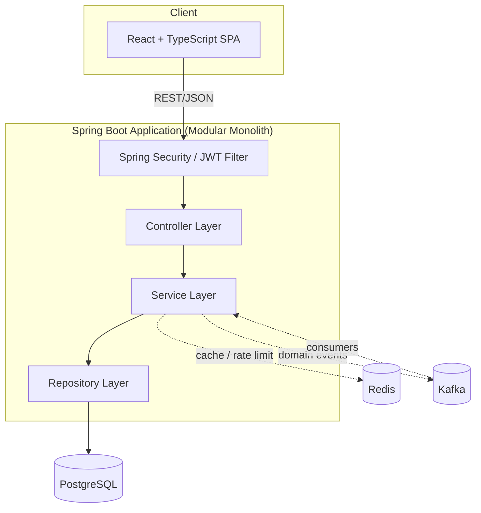
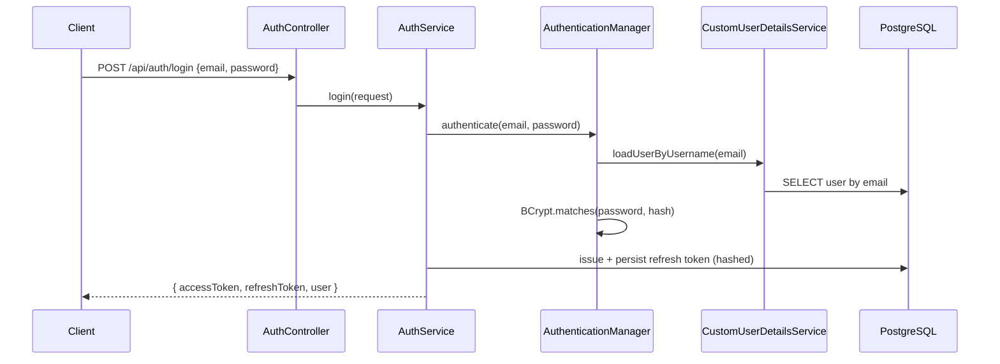
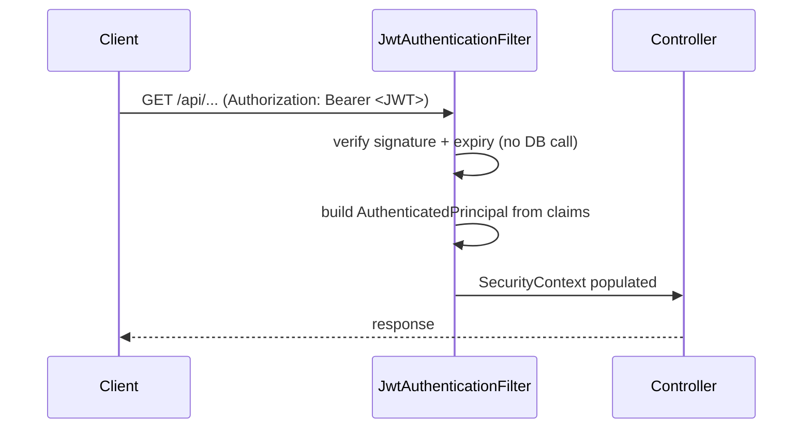
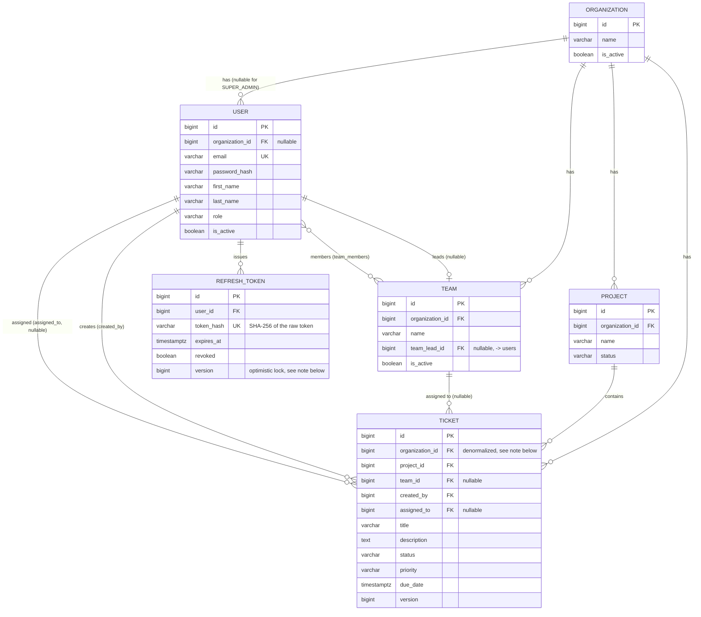

# FlowDesk

FlowDesk is a multi-tenant support and workflow management platform — a
lightweight combination of Jira and Zendesk. It is a portfolio project built
to demonstrate practical, production-style Spring Boot backend engineering:
multi-tenancy, RBAC, JWT auth with refresh token rotation, ticket workflow
state machines, JPA/Hibernate performance concerns, Redis caching and rate
limiting, Kafka-driven domain events, and a tested, containerized,
CI-backed delivery pipeline.

The backend is the primary focus of this project. The frontend (React +
TypeScript) is intentionally kept simpler.

> **Status:** Phase 3 (Authentication) complete. See [Development phases](#development-phases) below.

## Project overview

An organization (tenant) has users, teams, and projects. Projects contain
tickets. Tickets move through a controlled workflow, get assigned to
agents/teams, accumulate comments and an audit trail, and trigger
notifications on important events. Users authenticate via JWT and are
authorized by role, scoped to their own organization's data.

## Tech stack

**Backend**
- Java 21, Spring Boot 3.5.3
- Spring Web, Spring Data JPA (Hibernate), Spring Security, Spring Validation
- Spring Cache, Spring AOP, Spring Actuator, Spring Kafka
- PostgreSQL 16, Flyway
- Redis
- JJWT (self-signed JWT issuance/validation)
- Lombok
- Maven (via Maven Wrapper)

**Frontend** *(added in Phase 12)*
- React, TypeScript, React Router, Axios

**Infrastructure**
- Docker / Docker Compose
- GitHub Actions

> **Note on Spring Boot version:** the Spring Boot 3.x line is used
> deliberately (pinned to the last 3.x GA, 3.5.3) rather than the current
> 4.x line, matching the intended scope of this project. Spring Initializr
> no longer offers 3.x as a generation option, so the Maven project here
> was scaffolded by hand against `spring-boot-starter-parent:3.5.3`.

## Architecture

FlowDesk is a **modular monolith**, not a microservices system.



### Why a modular monolith?

The domain (organizations, users, teams, projects, tickets) is cohesive and
highly relational — most operations touch multiple entities in a single
transaction (e.g. assigning a ticket updates the ticket, writes an activity
record, and may update team workload). Splitting this into independently
deployed services would introduce distributed transaction complexity and
network overhead without a corresponding scaling or team-ownership benefit
at this project's scale. Instead, the codebase is organized into clearly
bounded modules (`auth`, `user`, `organization`, `team`, `project`,
`ticket`, `comment`, `notification`, `dashboard`, `audit`) with disciplined
internal layering, so any module could be extracted into its own service
later if a genuine scaling reason emerged.

## Modules

| Module | Responsibility |
|---|---|
| `auth` | Registration, login, JWT issuance, refresh token rotation, logout |
| `user` | User CRUD, role management, profile |
| `organization` | Tenant (organization) management |
| `team` | Teams within an organization, membership, team leads |
| `project` | Projects within an organization |
| `ticket` | Core ticket CRUD, workflow, assignment, filtering/search |
| `comment` | Ticket comments |
| `notification` | In-app notifications driven by domain events |
| `dashboard` | Aggregated reporting endpoints |
| `audit` | Ticket activity history |
| `common` | Shared exceptions, base types, utilities used across modules |
| `config` | Cross-cutting Spring configuration (security, cache, Kafka, etc.) |
| `security` | JWT issuance/validation, the per-request auth filter, Spring Security config |

Each module separates `entity` / `repository` / `service` / `controller` /
`dto` / `mapper` / `exception` into their own sub-packages — but only the
layers that module actually needs; a layer isn't created just for
symmetry with the others. As of Phase 3:

```
com.flowdesk.auth
├── entity/        RefreshToken
├── repository/    RefreshTokenRepository
├── service/       AuthService
├── controller/    AuthController
├── dto/           RegisterRequest, LoginRequest, RefreshRequest, AuthResponse
└── exception/     InvalidRefreshTokenException

com.flowdesk.ticket
├── entity/        Ticket, TicketStatus, TicketPriority
└── repository/    TicketRepository
    (service/, controller/, dto/, mapper/ land here in Phase 4)
```

## Multi-tenancy

*(Enforced starting Phase 5; documented in detail once implemented.)*

FlowDesk uses a **shared database, shared schema** multi-tenant model.
Tenant-owned tables carry an `organization_id` column, and tenant isolation
is enforced in the service/repository layer — never assumed from the
frontend. A user from Organization A must never be able to read or modify
Organization B's data via any API, regardless of what IDs are guessed or
passed in.

## Authentication flow

FlowDesk uses two independent authentication mechanisms, matching the
spec's two flow diagrams (Section 8) - one for logging in, one for every
request afterward:





**Login** goes through Spring Security's real machinery -
`AuthenticationManager` → `DaoAuthenticationProvider` →
`CustomUserDetailsService` → `PasswordEncoder` (BCrypt) - a one-time
database hit per login, which is fine since logins are infrequent.

**Every other authenticated request** is authenticated entirely by
`JwtAuthenticationFilter`, which verifies the JWT's signature and expiry
and builds the security principal directly from its claims -
`UserDetailsService` and the database are never touched. This is the
spec's explicit guidance: don't invalidate/re-validate access tokens via
an expensive per-request database lookup.

**JWT claims:** `sub` (user id), `email`, `role`, `organizationId`
(omitted for `SUPER_ADMIN`), `iat`, `exp`. The spec describes this as
`roles` (plural); FlowDesk models one role per user, so the claim is
singular - documented here rather than left as an unexplained deviation.

**Trade-off this implies:** if a user is deactivated or has their role
changed, their current access token remains valid - and thus so do their
old permissions - until it naturally expires (`app.jwt.access-token-ttl`,
15 minutes by default). A password change or deactivation does *not*
retroactively revoke already-issued access tokens. Refreshing *does* hit
the database and re-checks `User.active`, so this staleness window is
bounded to at most one access-token lifetime and never survives a
refresh.

**Refresh tokens** are opaque random strings (256 bits of entropy via
`SecureRandom`), not JWTs - there's no benefit to making them
self-describing when they're checked against the database on every use
anyway (for rotation and revocation). Only a SHA-256 hash of the token is
stored (see [Database schema](#database-schema) for why SHA-256 and not
BCrypt here). Every successful `/api/auth/refresh` call **rotates** the
token: the presented one is revoked and a brand new one issued, so a
stolen refresh token stops working the moment the legitimate client next
refreshes.

**Logout** revokes the presented refresh token server-side. There's
deliberately no way to invalidate an already-issued access token directly
(see the trade-off above) - only refresh tokens are revocable, which is
exactly what the spec asks for.

**Registration** (`POST /api/auth/register`) is self-service tenant
sign-up: it provisions a *brand-new organization* with the caller as its
first user, in the `ORG_ADMIN` role, and logs them in immediately
(returns tokens directly, no separate login call needed). There is no way
to self-register into an *existing* organization - once RBAC exists
(Phase 5), an `ORG_ADMIN` adds further users to their organization
directly.

**Endpoints:**

| Method | Path | Auth required | Notes |
|---|---|---|---|
| POST | `/api/auth/register` | No | Creates org + first `ORG_ADMIN`, returns tokens |
| POST | `/api/auth/login` | No | Returns tokens |
| POST | `/api/auth/refresh` | No (refresh token in body) | Rotates the refresh token |
| POST | `/api/auth/logout` | No (refresh token in body) | Idempotent; always 204 |
| GET | `/api/auth/me` | Yes (access token) | Returns the caller's profile |

`/logout` and `/refresh` are intentionally not gated behind a valid
*access* token - the refresh token in the request body is itself the
credential being presented/revoked, and requiring a still-valid access
token just to log out would be user-hostile once it's already expired.

**Rate limiting** on login attempts (spec Section 25) is deferred to
Phase 7, once Redis is introduced - see [Redis](#redis).

**CSRF is disabled** for the API. CSRF matters for cookie-based session
authentication, where a browser automatically attaches credentials to
every request to a site, including ones triggered by a malicious page.
FlowDesk's API is stateless and bearer-token-based (`Authorization: Bearer
<token>`) - a browser never attaches that header on its own, so there's
no cross-site request forgery vector to defend against here. **CORS** is
configured with an explicit allow-list (`app.cors.allowed-origins`,
defaulting to the local Vite/CRA dev server ports), not a wildcard.

## Database schema



Migrations: `backend/src/main/resources/db/migration/V1__create_organizations.sql`
through `V7__create_refresh_tokens.sql`.

### Schema design decisions

- **`organization_id` is nullable on `users`.** `SUPER_ADMIN` accounts are
  platform-level — they manage organizations themselves rather than
  belonging to one — so they're the only role without an organization.
  Every other role always has one.
- **Email is unique platform-wide**, not per-organization, so login can
  look a user up by email alone without first asking which organization
  they belong to.
- **`tickets.organization_id` is denormalized** — a ticket is already
  transitively scoped to an organization via `project.organization`, but
  storing it directly avoids joining through `projects` on every single
  tenant-scoped query and filter (status/priority/team/assignee — see
  Section 15/16 of the spec). The tradeoff, enforced in the service
  layer once ticket mutation exists (Phase 4), is that
  `ticket.organization` and `ticket.project.organization` must always
  agree.
- **`team_members` is a plain join table**, not a dedicated entity.
  Membership carries no attributes of its own (no joined-at timestamp,
  no per-team role), so `@ManyToMany` is enough — a `TeamMember` entity
  would be an abstraction with nothing to hold.
- **Indexes** beyond the primary keys: every FK column tenant-scoped
  tables use for filtering gets its own index (`organization_id`,
  `project_id`, `team_id`, `assigned_to`, `status`, `priority`,
  `created_at` on `tickets`), since Postgres does not automatically
  index foreign key columns. Two composite indexes
  (`organization_id, status` and `organization_id, created_at desc`)
  match the two query shapes every ticket list actually uses: scoped to
  one organization, then filtered by status or sorted by recency.
- **`refresh_tokens.token_hash` stores SHA-256(raw token), never the raw
  token itself** - same reasoning as password storage: if this table
  leaked, the tokens must not be directly reusable. It's SHA-256 rather
  than BCrypt specifically because refresh/logout need an exact-match
  lookup by hash, which requires a deterministic digest; BCrypt salts
  every hash differently by design and can't be looked up this way. This
  is safe here because the raw token is 256 bits of `SecureRandom`
  entropy, not a low-entropy human-chosen secret - which is what BCrypt's
  deliberate slowness defends against.
- **`refresh_tokens.version` (optimistic lock)** closes a real race: two
  concurrent `/api/auth/refresh` calls presenting the same token could
  otherwise both read `revoked = false` before either commits its
  rotation, minting two valid sessions from a token meant to be single-use.
  `RefreshTokenConcurrencyTest` proves this with two genuinely-overlapping
  transactions (a `CyclicBarrier` forces both to read before either
  writes) rather than just asserting the annotation is present.

## JPA / Hibernate

- **Base entity + auditing.** All entities extend `common.BaseEntity`
  (`@MappedSuperclass`), which supplies the identity-strategy primary key
  and `createdAt`/`updatedAt` timestamps via Spring Data JPA auditing
  (`@EnableJpaAuditing` in `config.JpaAuditingConfig`) rather than being
  set manually in service code.
- **Dirty checking.** `DomainEntityMappingTest.ticketVersionIncrementsOnUpdate_dirtyCheckingDemonstration`
  mutates a managed `Ticket` with a plain setter and never calls
  `repository.save()` again — Hibernate detects the change against the
  persistence context's loaded snapshot and issues the `UPDATE` at flush
  time on its own.
- **Lazy loading by default.** Every `@ManyToOne`/`@ManyToMany`
  association is explicitly `FetchType.LAZY`. Combined with
  `spring.jpa.open-in-view: false` (set in Phase 1), an association is
  never loaded outside of an explicit transactional service method —
  there's no view-layer fallback that would silently trigger extra
  queries or fail with `LazyInitializationException` deep in a
  serializer.
- **Optimistic locking.** `Ticket.version` (`@Version`) is in place since
  Phase 2; the behavioral guarantee (a stale concurrent write raising
  `OptimisticLockException`) is exercised properly once ticket mutation
  exists as a service operation (Phase 6). `RefreshToken.version`, added
  in Phase 3, is the first place this project actually needs and tests
  the concurrency guarantee end-to-end: `AuthService.refresh` forces an
  immediate flush (`saveAndFlush`, not `save`) specifically so a
  concurrent rotation surfaces as a catchable
  `ObjectOptimisticLockingFailureException` inside the method rather than
  only at commit time, and `RefreshTokenConcurrencyTest` proves it under
  real overlapping transactions.
- **N+1 prevention** is a query-shape concern (list endpoints, filters,
  projections) rather than a mapping concern, so it's addressed where
  those queries are actually written — ticket listing/filtering in
  Phase 6.

## Redis

*(Implemented in Phase 7: caching for read-heavy lookups and distributed
rate limiting for auth endpoints.)*

## Kafka

*(Implemented in Phase 8: `TicketCreated`, `TicketAssigned`,
`TicketStatusChanged`, `TicketCommentAdded`, `TicketClosed` events,
consumed by independent notification and audit consumers.)*

## Testing

Formal test infrastructure (Testcontainers, a dedicated `test` profile,
CI integration) is built out in Phase 10. Until then, tests run against
the same docker-compose PostgreSQL instance developers use locally
(`docker compose up -d postgres`), on the `dev` profile - but meaningful
test coverage is added incrementally alongside each phase rather than
deferred entirely, per the spec's own guidance to verify every phase
before moving on:

- **`AuthServiceTest`** (JUnit 5 + Mockito) - unit tests with every
  collaborator mocked: registration, login delegation to
  `AuthenticationManager`, refresh token rotation and its rejection
  paths (expired/revoked/unknown/concurrently-rotated), logout.
- **`AuthControllerIntegrationTest`** (MockMvc, real Spring Security
  filter chain) - the full HTTP-level flow: registration, duplicate
  email, validation errors, wrong-password rejection, the JWT-protected
  `/me` endpoint with and without a token, refresh rotation (including
  that a rotated-away token is rejected on reuse), and logout.
- **`RefreshTokenConcurrencyTest`** - two real, genuinely-overlapping
  database transactions racing to rotate the same refresh token, proving
  the optimistic lock actually prevents a double-issue rather than just
  asserting `@Version` is present.
- **`DomainEntityMappingTest`** (Phase 2) - entity relationships,
  DB-level constraints, dirty checking.

27 tests total as of Phase 3, all passing.

## Running locally

### Prerequisites
- Docker + Docker Compose
- Java 21 (only needed if running the backend outside Docker; the Maven
  wrapper handles Maven itself)

### Steps

```bash
# 1. Copy environment template
cp .env.example .env

# 2. Start infrastructure (PostgreSQL for now; Redis/Kafka added in later phases)
docker compose up -d postgres

# 3. Run the backend
cd backend
./mvnw spring-boot:run
```

The API starts on `http://localhost:8080`. Health check:

```bash
curl http://localhost:8080/actuator/health
```

> **Local port note:** the Dockerized PostgreSQL is mapped to host port
> `5433` (not `5432`) to avoid clashing with a locally installed PostgreSQL
> service, if one is running. Adjust `DB_PORT` in `.env` if your setup
> differs.

> **JWT secret note:** the `dev` profile has a built-in (insecure,
> clearly-labeled) fallback signing secret, so no setup is needed locally.
> The `prod` profile has no such fallback - `JWT_SECRET` is required and
> the app fails to start without it. Generate a real one with
> `openssl rand -base64 48`.

### Running tests

```bash
cd backend
./mvnw test
```

## API documentation

*(Swagger/OpenAPI UI wired up in Phase 11, available at `/swagger-ui.html`
once implemented.)*

## Architecture decisions (ADR-style)

**Why PostgreSQL?** The domain has real relationships (organizations →
teams/projects/tickets), transactional workflows (ticket assignment,
status transitions), and reporting/filtering needs best served by a
relational database with strong consistency guarantees.

**Why Flyway over Hibernate `ddl-auto`?** Schema changes must be
versioned, reviewable, and reproducible across environments.
`ddl-auto` is set to `validate` in every profile — Hibernate is never
allowed to silently alter the schema, even in local development.

**Why Redis?** For read-heavy caching (team/org lookups, dashboard
summaries) and for distributed rate limiting that works correctly across
multiple application instances, which an in-memory counter cannot do.

**Why Kafka?** To decouple ticket-mutating operations from side effects
(notifications, audit logging) that shouldn't block or fail the primary
request if they're slow or temporarily unavailable.

**Why optimistic locking (`@Version`) on tickets?** Multiple agents can
open and edit the same ticket concurrently. Optimistic locking makes a
lost update fail loudly (`OptimisticLockException`) instead of silently
overwriting another user's change.

**Why DTOs everywhere at the API boundary?** To control the public API
contract independently of persistence models, prevent entity leakage
(passwords, refresh tokens, internal fields), and avoid Jackson
serialization issues from lazy-loaded JPA associations.

**Why auto-increment bigint IDs instead of UUIDs?** Tenant isolation is
enforced server-side regardless of whether an ID is guessable, so UUIDs
would add index/storage overhead and uglier debugging without closing any
actual security gap here. Simple `IDENTITY` columns keep migrations,
joins, and JPQL easier to read — appropriate for this project's scale.

**Why is `organization_id` nullable on `users`?** Only `SUPER_ADMIN`
accounts need this: they manage organizations themselves (per their
permission set) and aren't scoped to one. Every other role always has an
organization. See [Database schema](#database-schema) for the full
reasoning.

**Why JJWT instead of `spring-boot-starter-oauth2-resource-server`?** The
resource-server starter is built to validate tokens issued by an
*external* identity provider, typically fetched via a JWKS endpoint.
FlowDesk issues its own tokens, so a direct JWT library that just signs
and verifies with a shared secret is the right-sized tool - pulling in
OAuth2 resource-server infrastructure for tokens the app itself mints
would be solving a problem FlowDesk doesn't have.

**Why does the JWT filter never call `UserDetailsService`?** Because
doing so on every request - to re-check the user is still active, hasn't
changed role, etc. - is exactly the "expensive database lookup on every
request" the spec explicitly warns against for token validation.
`UserDetailsService` exists solely for the login endpoint's one-time
credential check. The trade-off (a deactivated user's current access
token remains valid until it expires) is documented in
[Authentication flow](#authentication-flow) and bounded to at most one
token lifetime.

**Why are refresh tokens stored as a SHA-256 hash, not BCrypt like
passwords?** Refresh/logout need an exact-match database lookup by the
presented token, which requires a deterministic hash. BCrypt salts every
hash differently by design specifically so two identical inputs don't
produce the same output - correct for passwords, incompatible with a
lookup-by-hash access pattern. This is safe because the raw refresh token
is 256 bits of `SecureRandom` entropy, not a low-entropy secret a human
chose - brute-forcing it is infeasible regardless of hash speed, which is
precisely the property BCrypt's slowness exists to compensate for when
that's *not* true (passwords).

**Why refresh token *rotation*, not just a long-lived reusable refresh
token?** A reusable refresh token is a single credential valid for its
entire lifetime (7 days by default) - if it leaks, so does that whole
window. Rotation means each refresh both authenticates the client and
immediately invalidates the presented token, so a stolen refresh token
stops working the moment the legitimate client next refreshes, narrowing
the exposure window from "up to 7 days" to "until the next refresh."

**Why register only self-service *new organizations*, not joining an
existing one?** Keeps the public, unauthenticated surface area minimal
during this phase. Adding a user to an *existing* organization is
naturally an authenticated, authorized action (an `ORG_ADMIN` inviting
someone), which needs RBAC (Phase 5) to be meaningful - building it
before then would mean either no authorization check at all, or a check
with nothing yet to enforce it against.

## Development phases

This project is built incrementally, one phase at a time, each verified
(build, tests, boot, self-review) before moving to the next:

- [x] **Phase 1** — Project setup (Spring Boot, Maven, PostgreSQL, Flyway, Docker, health endpoint)
- [x] **Phase 2** — Core domain (Organization, User, Team, Project, Ticket)
- [x] **Phase 3** — Authentication (JWT, refresh tokens, BCrypt, Spring Security)
- [ ] Phase 4 — Ticket workflow (CRUD, transitions, comments, validation)
- [ ] Phase 5 — Multi-tenancy enforcement
- [ ] Phase 6 — Advanced JPA (pagination, specifications, projections, N+1, optimistic locking)
- [ ] Phase 7 — Redis (caching, rate limiting)
- [ ] Phase 8 — Kafka (domain events, notification/audit consumers)
- [ ] Phase 9 — Dashboard + scheduled jobs
- [ ] Phase 10 — Testing (unit, controller, integration, Testcontainers)
- [ ] Phase 11 — Production readiness (Actuator, logging, correlation IDs, CI, OpenAPI)
- [ ] Phase 12 — React frontend

## Repository layout

```
flowdesk/
├── backend/            Spring Boot application (primary focus)
├── frontend/           React + TypeScript SPA (added in Phase 12)
├── docker-compose.yml  Local infrastructure (Postgres now; Redis/Kafka later)
├── .env.example        Environment variable template
└── .github/workflows/  CI pipeline (added in Phase 11)
```
