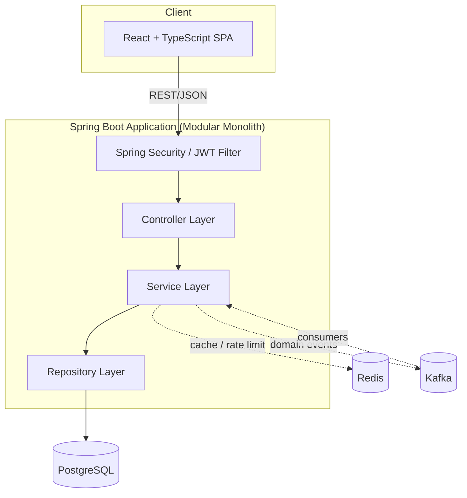

# FlowDesk

FlowDesk is a multi-tenant support and workflow management platform — a
lightweight combination of Jira and Zendesk. It is a portfolio project built
to demonstrate practical, production-style Spring Boot backend engineering:
multi-tenancy, RBAC, JWT auth with refresh token rotation, ticket workflow
state machines, JPA/Hibernate performance concerns, Redis caching and rate
limiting, Kafka-driven domain events, and a tested, containerized,
CI-backed delivery pipeline.

The backend is the primary focus of this project. The frontend (React +
TypeScript) is intentionally kept simpler.

> **Status:** Phase 1 (Project Setup) complete. See [Development phases](#development-phases) below.

## Project overview

An organization (tenant) has users, teams, and projects. Projects contain
tickets. Tickets move through a controlled workflow, get assigned to
agents/teams, accumulate comments and an audit trail, and trigger
notifications on important events. Users authenticate via JWT and are
authorized by role, scoped to their own organization's data.

## Tech stack

**Backend**
- Java 21, Spring Boot 3.5.3
- Spring Web, Spring Data JPA (Hibernate), Spring Security, Spring Validation
- Spring Cache, Spring AOP, Spring Actuator, Spring Kafka
- PostgreSQL 16, Flyway
- Redis
- Maven (via Maven Wrapper)

**Frontend** *(added in Phase 12)*
- React, TypeScript, React Router, Axios

**Infrastructure**
- Docker / Docker Compose
- GitHub Actions

> **Note on Spring Boot version:** the Spring Boot 3.x line is used
> deliberately (pinned to the last 3.x GA, 3.5.3) rather than the current
> 4.x line, matching the intended scope of this project. Spring Initializr
> no longer offers 3.x as a generation option, so the Maven project here
> was scaffolded by hand against `spring-boot-starter-parent:3.5.3`.

## Architecture

FlowDesk is a **modular monolith**, not a microservices system.



### Why a modular monolith?

The domain (organizations, users, teams, projects, tickets) is cohesive and
highly relational — most operations touch multiple entities in a single
transaction (e.g. assigning a ticket updates the ticket, writes an activity
record, and may update team workload). Splitting this into independently
deployed services would introduce distributed transaction complexity and
network overhead without a corresponding scaling or team-ownership benefit
at this project's scale. Instead, the codebase is organized into clearly
bounded modules (`auth`, `user`, `organization`, `team`, `project`,
`ticket`, `comment`, `notification`, `dashboard`, `audit`) with disciplined
internal layering, so any module could be extracted into its own service
later if a genuine scaling reason emerged.

## Modules

| Module | Responsibility |
|---|---|
| `auth` | Registration, login, JWT issuance, refresh token rotation, logout |
| `user` | User CRUD, role management, profile |
| `organization` | Tenant (organization) management |
| `team` | Teams within an organization, membership, team leads |
| `project` | Projects within an organization |
| `ticket` | Core ticket CRUD, workflow, assignment, filtering/search |
| `comment` | Ticket comments |
| `notification` | In-app notifications driven by domain events |
| `dashboard` | Aggregated reporting endpoints |
| `audit` | Ticket activity history |
| `common` | Shared exceptions, base types, utilities used across modules |
| `config` | Cross-cutting Spring configuration (security, cache, Kafka, etc.) |
| `security` | JWT filter, authentication/authorization infrastructure |

Each module is expected to separate `controller` / `service` / `repository`
/ `entity` / `dto` / `mapper` where the module actually needs that layer —
layers are not created just for symmetry.

## Multi-tenancy

*(Enforced starting Phase 5; documented in detail once implemented.)*

FlowDesk uses a **shared database, shared schema** multi-tenant model.
Tenant-owned tables carry an `organization_id` column, and tenant isolation
is enforced in the service/repository layer — never assumed from the
frontend. A user from Organization A must never be able to read or modify
Organization B's data via any API, regardless of what IDs are guessed or
passed in.

## Authentication flow

*(Implemented in Phase 3; documented in detail once implemented.)*

JWT access tokens (short-lived) carry `userId`, `organizationId`, `roles`,
issued-at and expiration claims, and are validated statelessly on every
request — no database lookup per request. Refresh tokens are longer-lived,
stored server-side, rotated on use, and revocable (which is how logout is
implemented, rather than trying to invalidate already-issued access
tokens).

## Database schema

*(Populated as entities are introduced in Phase 2 onward.)*

## JPA / Hibernate

*(Documented as N+1 prevention, optimistic locking, and transaction
boundaries are introduced in Phases 2, 4, and 6.)*

## Redis

*(Implemented in Phase 7: caching for read-heavy lookups and distributed
rate limiting for auth endpoints.)*

## Kafka

*(Implemented in Phase 8: `TicketCreated`, `TicketAssigned`,
`TicketStatusChanged`, `TicketCommentAdded`, `TicketClosed` events,
consumed by independent notification and audit consumers.)*

## Testing

*(Implemented in Phase 10: JUnit 5 + Mockito unit tests, MockMvc controller
tests, Testcontainers-backed integration tests against real PostgreSQL.)*

## Running locally

### Prerequisites
- Docker + Docker Compose
- Java 21 (only needed if running the backend outside Docker; the Maven
  wrapper handles Maven itself)

### Steps

```bash
# 1. Copy environment template
cp .env.example .env

# 2. Start infrastructure (PostgreSQL for now; Redis/Kafka added in later phases)
docker compose up -d postgres

# 3. Run the backend
cd backend
./mvnw spring-boot:run
```

The API starts on `http://localhost:8080`. Health check:

```bash
curl http://localhost:8080/actuator/health
```

> **Local port note:** the Dockerized PostgreSQL is mapped to host port
> `5433` (not `5432`) to avoid clashing with a locally installed PostgreSQL
> service, if one is running. Adjust `DB_PORT` in `.env` if your setup
> differs.

### Running tests

```bash
cd backend
./mvnw test
```

## API documentation

*(Swagger/OpenAPI UI wired up in Phase 11, available at `/swagger-ui.html`
once implemented.)*

## Architecture decisions (ADR-style)

**Why PostgreSQL?** The domain has real relationships (organizations →
teams/projects/tickets), transactional workflows (ticket assignment,
status transitions), and reporting/filtering needs best served by a
relational database with strong consistency guarantees.

**Why Flyway over Hibernate `ddl-auto`?** Schema changes must be
versioned, reviewable, and reproducible across environments.
`ddl-auto` is set to `validate` in every profile — Hibernate is never
allowed to silently alter the schema, even in local development.

**Why Redis?** For read-heavy caching (team/org lookups, dashboard
summaries) and for distributed rate limiting that works correctly across
multiple application instances, which an in-memory counter cannot do.

**Why Kafka?** To decouple ticket-mutating operations from side effects
(notifications, audit logging) that shouldn't block or fail the primary
request if they're slow or temporarily unavailable.

**Why optimistic locking (`@Version`) on tickets?** Multiple agents can
open and edit the same ticket concurrently. Optimistic locking makes a
lost update fail loudly (`OptimisticLockException`) instead of silently
overwriting another user's change.

**Why DTOs everywhere at the API boundary?** To control the public API
contract independently of persistence models, prevent entity leakage
(passwords, refresh tokens, internal fields), and avoid Jackson
serialization issues from lazy-loaded JPA associations.

## Development phases

This project is built incrementally, one phase at a time, each verified
(build, tests, boot, self-review) before moving to the next:

- [x] **Phase 1** — Project setup (Spring Boot, Maven, PostgreSQL, Flyway, Docker, health endpoint)
- [ ] Phase 2 — Core domain (Organization, User, Team, Project, Ticket)
- [ ] Phase 3 — Authentication (JWT, refresh tokens, BCrypt, Spring Security)
- [ ] Phase 4 — Ticket workflow (CRUD, transitions, comments, validation)
- [ ] Phase 5 — Multi-tenancy enforcement
- [ ] Phase 6 — Advanced JPA (pagination, specifications, projections, N+1, optimistic locking)
- [ ] Phase 7 — Redis (caching, rate limiting)
- [ ] Phase 8 — Kafka (domain events, notification/audit consumers)
- [ ] Phase 9 — Dashboard + scheduled jobs
- [ ] Phase 10 — Testing (unit, controller, integration, Testcontainers)
- [ ] Phase 11 — Production readiness (Actuator, logging, correlation IDs, CI, OpenAPI)
- [ ] Phase 12 — React frontend

## Repository layout

```
flowdesk/
├── backend/            Spring Boot application (primary focus)
├── frontend/           React + TypeScript SPA (added in Phase 12)
├── docker-compose.yml  Local infrastructure (Postgres now; Redis/Kafka later)
├── .env.example        Environment variable template
└── .github/workflows/  CI pipeline (added in Phase 11)
```
